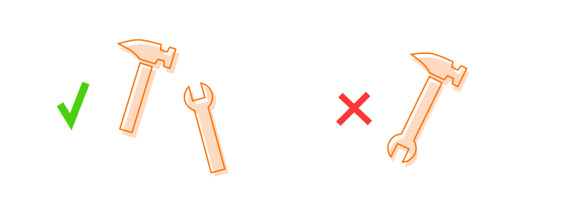

# SOLID Principles

1. SOLID Principles are a set of principles, following which one can develop a maintainable, extensible and scalable applications.
2. SOLID consists of 5 principles - Single Responsibility Principle (SRP), Open-Closed Principle (OCP), Liskov's substitution Principle (LSP), Interface segregation Principle (ISP) and Dependency Inversion Principle (DIP).

## Single Responsibility Principle:
- It states that every class or method (or a block of code), must possess a single and independent responsibility or functionality to adhere with.
- If there are multiple functionalities implemented under a single roof, then there is clear red flag for SRP principle. It can lead to high maintenance, low readability, lesser re-usability and extensive (but unnnecessary) testing of the method or class.
- There will always be chance of high coupling or inter dependency of the logics, if they are implemented under a single roof (i.e. a method or a class).

- Some of the common places where SRP voilation is detected are:
1. IF-ELSE Ladder
2. Utility classes, loaded with tons of methods.
3. God class/Monster class : A class/method that contains almost every logic it should have. 
Example,

```java
public static boolean createUser(String whichDatabase,String query){
    //1. Logic to create the connection using the DriverManagers.
    /* 2. Establishing the connection
        if(whichDatabase.equalsIgnoreCase("transaction")){
            .....
        }
        else if(whichDatabase.equalsIgnoreCase("master")){
            .....
        }
        else{
            .....
        }
    
    */

   //3. Create the statements with the query.
   //4. Checking if the user exists
   //5. Create the user in case it doesnt exist else return false.
}
``` 
- Such a method which has all functionalities in-built, are called God methods/Monster methods. There is a tight coupling of the functionalities in the single function.

- If we have if-else ladder which is deciding the flow of control, there will always be high maintenance, low readability and lesser re-usability of code. Suppose, if some more databases add up to the above if-else ladder to deal with the flow, we will have change this ladder, which will bring more testing, as our change can break the code.

``` java
Package java.util:

Contains the collections framework, legacy collection classes, event model, date and time facilities, internationalization, and miscellaneous utility classes (a string tokenizer, a random-number generator, and a bit array).
```


Here, SRP can be considered as voilated by adding so many functionality within single package.

<ins>Think in terms of responsibilities</ins> - Doing a lot of things in a single class/block of code - SRP voilation.

<ins>Think in terms of coupling of responsibilities </ins> - If something is prone to changes and can be separated out!

<ins>Think in terms of testing the code </ins> - For a small modification, if I will not have to test the entire functionality.If we have test it more than required, we should separate it!

## Open Closed Principle:
- It states that any block of code, be it a class or a method, should be open for extension and closed for modification.
- Modification with respect to method's responsibility (what method is intended to do) is possible, but bringing in of new functionalities/changes should be stopped.
- Whereas extension of its own functional logic is allowed, but adding of new functionality is not allowed.

- Handling of OCP leads to resolved SRP.

### Note: Change a method only if the logic of that specific functionality is changing, otherwise if there is a new thing coming in, try adding it in a de-coupled way, so that it doesn't bring dependency into the code. (Code is extensible, from its functionality perspective but it should be as closed as possible, for a modification). Try keeping your changes as decoupled as possible.